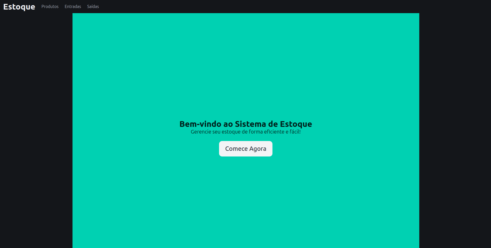
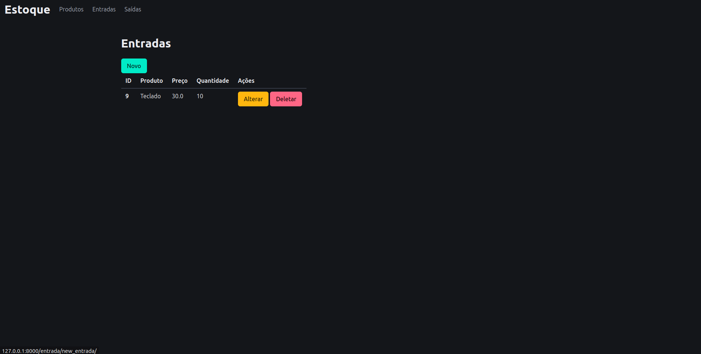
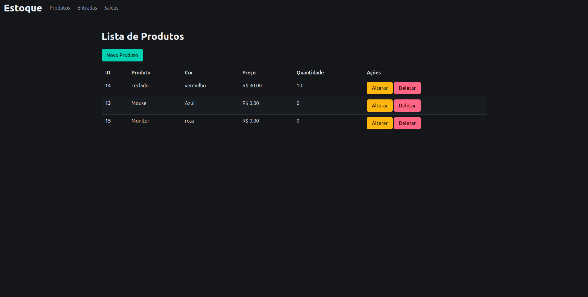
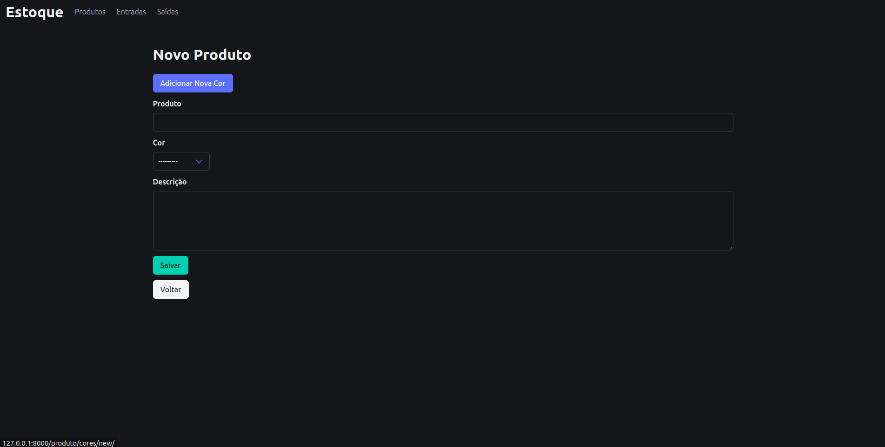
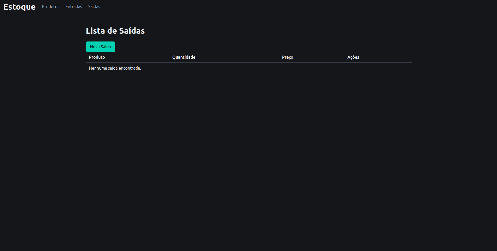
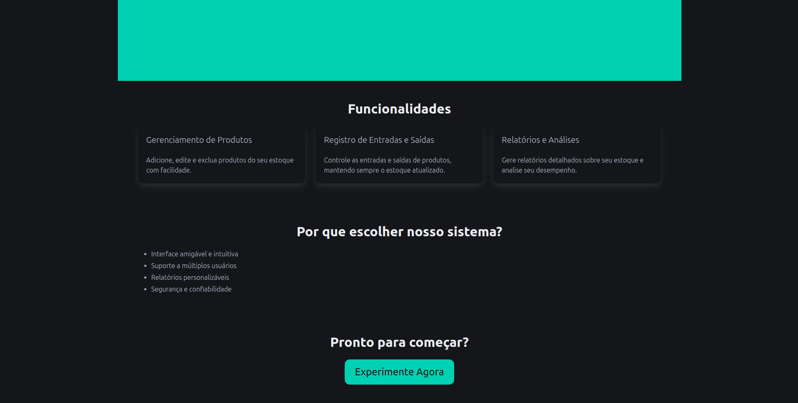

# Sistema de Gerenciamento de Estoque

Este é um projeto Django para gerenciamento de estoque, permitindo que os usuários adicionem, editem e excluam produtos, além de registrar entradas e saídas de produtos. O sistema também fornece relatórios e análises sobre o estoque.

## Tecnologias Utilizadas

- **Django**: Framework web para desenvolvimento de aplicações.
- **Bulma**: Framework CSS para estilização responsiva.
- **SQLite**: Banco de dados padrão do Django (pode ser alterado para PostgreSQL, MySQL, etc.).

## Como ficou








## Funcionalidades

- Cadastro de produtos
- Edição e exclusão de produtos
- Registro de entradas e saídas de produtos
- Geração de relatórios sobre o estoque

## Pré-requisitos

Antes de começar, você precisará ter o Python e o Django instalados em sua máquina. Você pode instalar o Django usando o pip:

```bash
pip install django